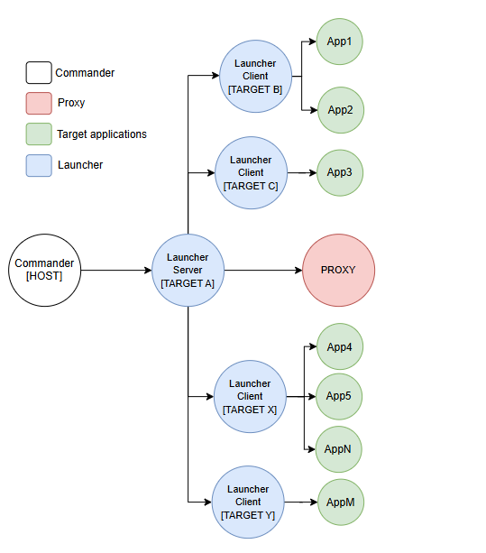
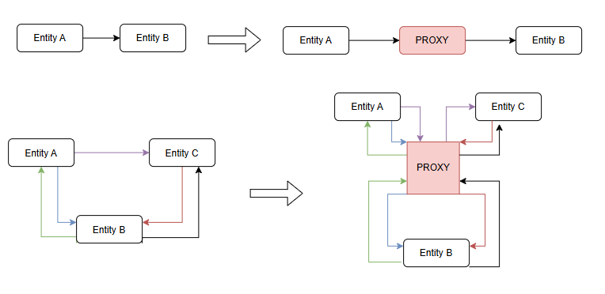
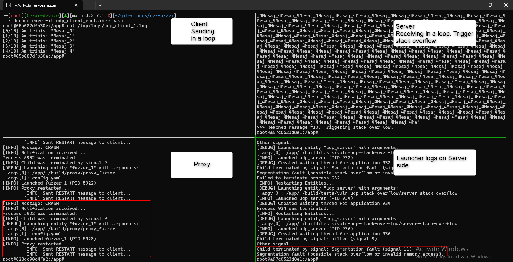

# 🧪 cezFuzzer

`cezFuzzer` is a powerful, modular fuzzing framework for UDP and TCP-based applications. It enables man-in-the-middle traffic interception, mutation, and crash detection — all orchestrated in a distributed containerized environment.

---

## 🚀 What It Does

- Intercepts **network traffic** between real client-server applications.
- Applies **fuzzing techniques** (e.g., using Radamsa) to mutate packets.
- Detects **crashes** such as segmentation faults and automatically restarts affected binaries.
- Offers full **orchestration via configuration files**, with support for any communication topology.

---

## 🧠 High-Level Architecture

The system is structured around four components:
1. **Commander** (central host that controls deployment and restarts)
2. **Launchers** (client/server agents running on multiple targets)
3. **Proxy** (man-in-the-middle traffic interceptor and fuzzer)
4. **Target Applications** (clients and servers under test)

Below is a visual representation of the architecture:



---

## 🔁 Proxy-Based Redirection

The proxy transparently intercepts traffic between any two communicating entities. It can operate on simple connections or complex multi-node setups.

### Examples:
- Direct communication: A → B  
- Intercepted: A → Proxy → B



This approach allows fuzzing without modifying the target binaries, by redirecting traffic through the proxy dynamically.

---

## 💥 Crash Simulation & Detection

The proxy and launcher components monitor for crashes such as stack overflows or segmentation faults. Upon crash:

- The system logs the event
- Sends a restart signal to the commander
- Relaunches the application

Crash detection is visible both in logs and the command-line interface:



---

## 🛠 Installation & Usage

### 📦 Prerequisites

- Python 3.8+
- Docker & Docker Compose
- C++ toolchain (GCC or Clang)
- Optional: [`radamsa`](https://gitlab.com/akihe/radamsa) for advanced fuzzing

---

## 🔧 Build & Clean

Build the entire system:

```bash
./build.sh --build
```

Clean all generated files:

```bash
./build.sh --clean
```

---

## 🧪 Running the System

1. Configure your `config.yaml` file with all desired entities and redirections.
2. Adjust the `Dockerfile.template` according to your application setup.
3. Place your test applications wherever needed.

Launch the system with:

```bash
./commander.py --config ./config.yaml --template ./Dockerfile.template
```

---

## 🔍 Debugging & Inspecting

To connect interactively to a running container:

```bash
docker exec -it <container_name> bash
```

To view logs from a launcher:

```bash
docker exec -it <container_name> cat /tmp/launcher.log
```

To view logs from a test application:

```bash
docker exec -it <container_name> cat /tmp/logs/<entity>_<LID>.log
```

---

## 📂 Folder Structure

```
.
├── commander/                # Main orchestration logic
├── config.yaml               # YAML config defining all entities
├── config_template.yaml      # Template config file
├── Dockerfile.template       # Generic Dockerfile used for container generation
├── docker/                   # Generated Dockerfiles per entity
├── proxy/                    # Source code for proxy and fuzzer
├── launcher/                 # Launcher scripts for container entrypoint
├── tests/                    # Test applications
├── test_suites/              # Structured suites of tests
├── radamsa                  # Fuzzing tool (external or submodule)
├── build/                    # Compiled binaries
├── .assets/                  # Images used in README
└── README.md
```

---

## 📌 Features Summary

- ✅ Multi-entity, distributed architecture
- ✅ UDP & TCP support
- ✅ Proxy-based fuzzing using real binaries
- ✅ Crash detection & auto-recovery
- ✅ Config-driven orchestration
- 🚧 TCP raw socket proxy (in development)
- 🚧 Web-based log dashboard (planned)

---

## 👤 Author

**Cezar**  
🔗 [LinkedIn](https://linkedin.com/in/cezarxyz)

---

## 📝 License

MIT License
